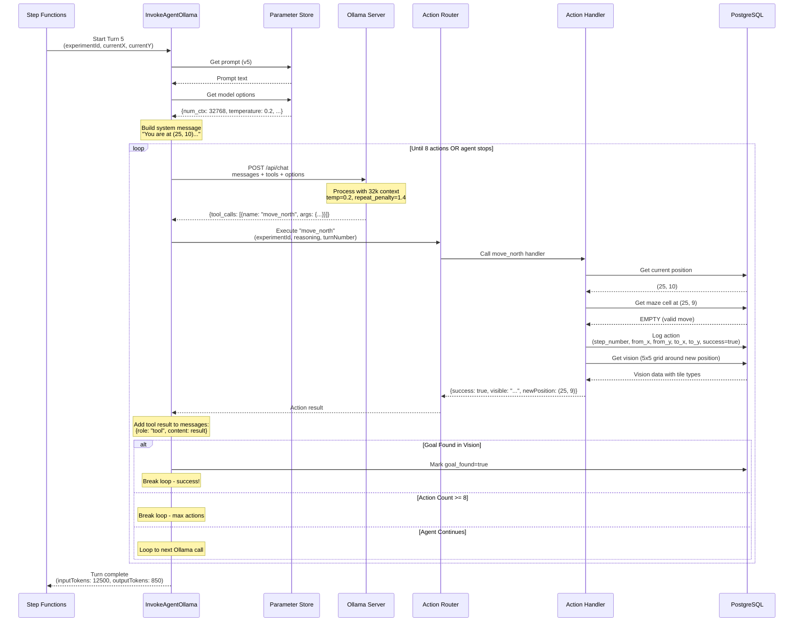

# Agent Turn Loop

How a single turn executes agent decisions with function calling (Ollama example).



## Turn Execution Details

### 1. Initialize Turn Context
```javascript
const systemMessage = `You are continuing a grid exploration experiment.

Experiment ID: ${experimentId}
Your Current Position: (${currentX}, ${currentY})
Goal: Find the goal marker (shown as 2 in vision)

${promptText}

Use the provided tools to navigate and explore.`;

messages = [{role: 'user', content: systemMessage}];
```

### 2. Call Ollama with Options
```javascript
POST https://ollama-server.com/api/chat
{
  "model": "llama3.1:8b",
  "messages": [...conversationHistory],
  "tools": [
    {name: "move_north", description: "..."},
    {name: "move_east", description: "..."},
    ...
  ],
  "options": {
    "num_ctx": 32768,        // 32K context window
    "temperature": 0.2,      // Deterministic navigation
    "num_predict": 2000,     // Max output tokens
    "repeat_penalty": 1.4    // Penalize loops
  }
}
```

### 3. Parse Tool Calls
Ollama returns:
```javascript
{
  "message": {
    "role": "assistant",
    "content": "I'll move north to explore...",
    "tool_calls": [
      {
        "function": {
          "name": "move_north",
          "arguments": {
            "reasoning": "Moving north to explore uncharted area"
          }
        }
      }
    ]
  },
  "prompt_eval_count": 12543,  // Input tokens
  "eval_count": 187            // Output tokens
}
```

### 4. Execute Action via Router
```javascript
// Router transforms to Bedrock Agent format
const payload = {
  actionGroup: 'maze-actions',
  apiPath: '/move_north',
  httpMethod: 'POST',
  requestBody: {
    content: {
      'application/json': {
        properties: [
          {name: 'experimentId', type: 'integer', value: 123},
          {name: 'reasoning', type: 'string', value: 'Moving north...'},
          {name: 'turnNumber', type: 'integer', value: 5},
          {name: 'stepNumber', type: 'integer', value: 37}
        ]
      }
    }
  }
};
```

### 5. Action Handler Execution
```javascript
// move_north.js
1. Get current position from DB: (25, 10)
2. Calculate target position: (25, 9) [north = y-1]
3. Check maze cell at target:
   - WALL (1): Return {success: false, message: "Hit a wall"}
   - EMPTY (0) or GOAL (2): Proceed
4. Get vision data (5x5 grid around new position)
5. Log to database:
   INSERT INTO agent_actions (
     experiment_id, step_number, action_type, reasoning,
     from_x, from_y, to_x, to_y, success,
     tiles_seen, turn_number, input_tokens, output_tokens
   ) VALUES (...)
6. Return result with vision:
   {
     success: true,
     message: "Moved north to (25, 9)",
     newPosition: {x: 25, y: 9},
     foundGoal: false,
     visible: "Grid (5x5 around you):\n  01110\n  00100\n..."
   }
```

### 6. Feed Result Back to LLM
```javascript
messages.push({
  role: 'tool',
  content: JSON.stringify({
    success: true,
    message: "Moved north to (25, 9)",
    visible: "Grid (5x5 around you):\n  01110\n..."
  })
});

// Next iteration: Ollama sees the result and can call more tools
```

## Loop Termination Conditions

The turn loop ends when ANY of these occur:

1. **Agent Stops**: `tool_calls` is empty or undefined
   - Agent decides no more actions needed this turn
   - Common after recall_all or when stuck

2. **Max Actions**: 8 actions executed in this turn
   - Hard limit to prevent infinite loops
   - Turn ends, but experiment continues (next turn)

3. **Goal Found**: Vision data contains GOAL marker (2)
   - `foundGoal: true` in action result
   - Triggers experiment finalization

4. **Error**: Lambda timeout, database error, etc.
   - Turn fails, experiment may finalize with error

## Context Window Management

### Problem (Before):
- Default `num_ctx`: 2,048 tokens
- Actual usage: **25,939 tokens** (92% truncated!)
- Models couldn't see their full recall_all data

### Solution (Now):
- Configured `num_ctx`: **32,768 tokens**
- Full conversation history preserved
- Recall data actually visible to model

### Example Context at Turn 50:
```
System prompt:           ~500 tokens
Tool definitions:      ~2,000 tokens
Last 50 actions:      ~20,000 tokens (400 per action avg)
Recent reasoning:      ~3,000 tokens
Current vision:          ~200 tokens
-----------------------------------
Total:                ~25,700 tokens ✓ Fits in 32K!
```
