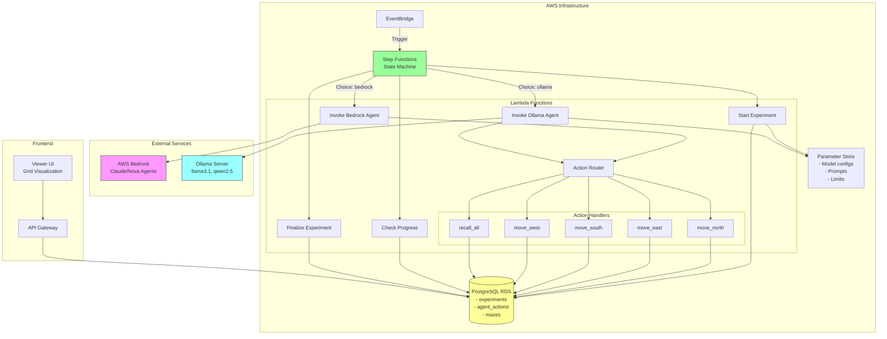

# System Architecture

High-level architecture of the Oriole AI agent maze navigation platform.

## Key Components

### External LLM Providers
- **AWS Bedrock**: Managed AI service (Claude, Nova models)
- **Ollama**: Local LLM server (llama3.1:8b, qwen2.5:7b)

### Orchestration
- **EventBridge**: Triggers experiments on schedule or manual invocation
- **Step Functions**: State machine that orchestrates experiment lifecycle
- **Parameter Store**: Centralized configuration (model params, prompts, limits)

### Compute
- **Lambda Functions**: Serverless execution for each workflow step
- **Action Router**: Directs tool calls to appropriate action handlers

### Storage
- **PostgreSQL RDS**: Persistent storage for experiments, actions, and maze data
- **model_config JSONB**: Stores model configuration for A/B testing

### Frontend
- **Viewer UI**: Web interface for visualizing maze grid and experiment results
- **API Gateway**: REST API for viewer data access
