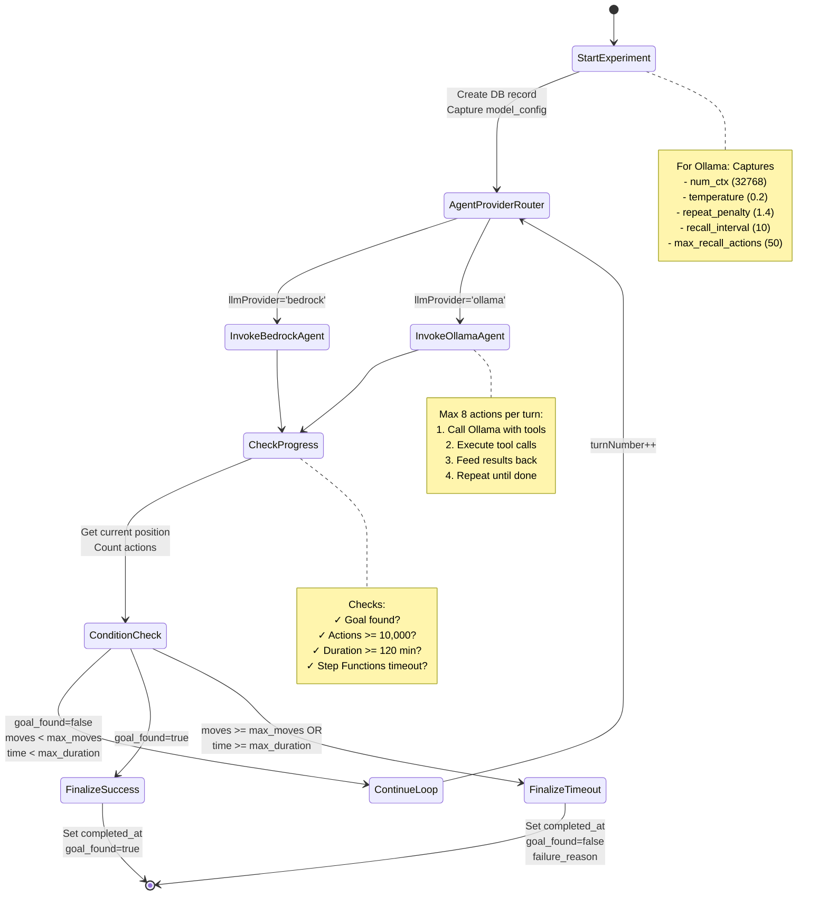

# Experiment Flow

Complete lifecycle of a maze navigation experiment through the Step Functions state machine.



## State Machine Flow

### 1. StartExperiment
**Purpose**: Initialize experiment in database
**Inputs**: agentId, modelName, promptVersion, mazeId, llmProvider
**Actions**:
- Create experiment record with `model_config` (Ollama only)
- Fetch and store current parameter values
- Return experimentId and starting position

**Outputs**: experimentId, currentX, currentY, turnNumber=1

---

### 2. AgentProviderRouter (Choice State)
**Purpose**: Route to correct LLM provider
**Logic**:
```javascript
if (llmProvider === 'ollama') {
  goto InvokeOllamaAgent
} else {
  goto InvokeBedrockAgent  // default
}
```

---

### 3. InvokeOllamaAgent / InvokeBedrockAgent
**Purpose**: Execute one turn of agent decision-making
**Actions**:
- Load prompt from Parameter Store
- Call LLM with tools/function definitions
- Execute up to 8 actions per turn
- Log all actions to database with vision data

**Outputs**: Updated position, token usage

---

### 4. CheckProgress
**Purpose**: Determine if experiment should continue
**Checks**:
1. `goal_found` from last action?
2. Total actions >= `max_moves` (10,000)?
3. Duration >= `max_duration_minutes` (120)?
4. Database locks or errors?

**Outputs**: Decision to continue or finalize

---

### 5. ConditionCheck (Choice State)
**Purpose**: Choose next state based on experiment status
**Logic**:
```javascript
if (goal_found === true) {
  goto FinalizeSuccess
} else if (actions >= max_moves || duration >= max_duration) {
  goto FinalizeTimeout
} else {
  goto ContinueLoop (increment turnNumber)
}
```

---

### 6. FinalizeExperiment
**Purpose**: Mark experiment as complete
**Actions**:
- Set `completed_at` timestamp
- Set `goal_found` boolean
- Store `failure_reason` if timed out

**Database Update**:
```sql
UPDATE experiments
SET completed_at = NOW(),
    goal_found = $1,
    failure_reason = $2
WHERE id = $3
```

---

## Timeout Handling

### Application Limits (Graceful)
- `max_moves`: 10,000 actions
- `max_duration_minutes`: 120 minutes
- **Result**: Runs FinalizeExperiment, sets completed_at

### Infrastructure Limit (Hard Stop)
- Step Functions timeout: 7,200 seconds (2 hours)
- Configurable via `/oriole/experiments/max-execution-seconds`
- **Result**: State machine killed, completed_at stays NULL ("zombie experiment")
- **Fix**: Viewer shows these as "stale" (no actions in 5 minutes)

---

## Turn Loop Details

Each turn executes **up to 8 actions**:

```
Turn 1: move_north, move_east, move_east, recall_all, move_south (5 actions)
Turn 2: move_west, move_north, move_north, move_east, move_east, move_east, recall_all, move_south (8 actions - max!)
Turn 3: move_north, move_west (2 actions, then agent stops calling tools)
```

The turn ends when:
- Agent stops requesting tools (no more tool_calls)
- 8 actions executed (hard limit per turn)
- Goal found
