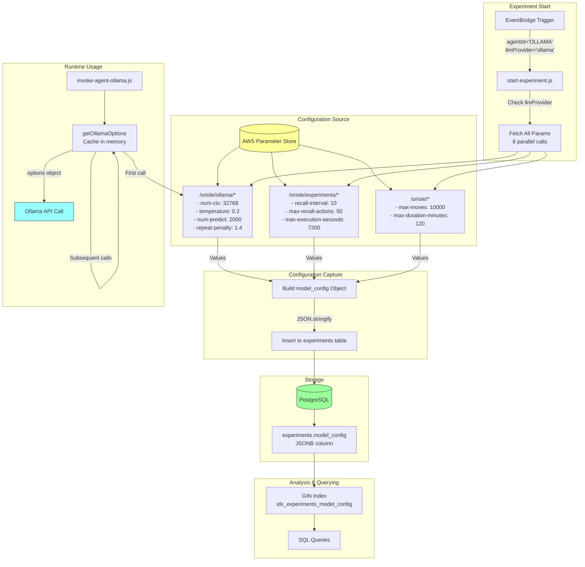

# Parameter Configuration Flow

How model parameters flow from AWS Parameter Store through the system to database storage.



## Parameter Flow Details

### 1. Parameter Store Structure

```
/oriole/
├── ollama/                          # Ollama-specific model parameters
│   ├── num-ctx          = 32768    # Context window size
│   ├── temperature      = 0.2      # Sampling temperature
│   ├── num-predict      = 2000     # Max output tokens
│   └── repeat-penalty   = 1.4      # Repetition penalty
│
├── experiments/                     # Experiment control parameters
│   ├── recall-interval           = 10    # Moves between recalls
│   ├── max-recall-actions        = 50    # Recall window size
│   └── max-execution-seconds     = 7200  # Step Functions timeout
│
├── max-moves                 = 10000  # Action limit
└── max-duration-minutes      = 120    # Time limit (2 hours)
```

---

### 2. Capture at Experiment Start

**When**: `start-experiment.js` creates experiment record

**Code**:
```javascript
// Only for llmProvider='ollama'
if (llmProvider === 'ollama') {
  const [numCtx, temperature, ...] = await Promise.all([
    ssmClient.send(new GetParameterCommand({Name: '/oriole/ollama/num-ctx'}))
      .then(r => parseInt(r.Parameter.Value))
      .catch(() => null),  // Defaults if missing
    // ... 7 more parallel fetches
  ]);

  modelConfig = {
    num_ctx: numCtx,
    temperature: temperature,
    num_predict: numPredict,
    repeat_penalty: repeatPenalty,
    recall_interval: recallInterval,
    max_recall_actions: maxRecallActions,
    max_moves: maxMoves,
    max_duration_minutes: maxDurationMinutes
  };
}

// Store in database
await db.query(
  `INSERT INTO experiments (..., model_config)
   VALUES (..., $8)`,
  [..., modelConfig ? JSON.stringify(modelConfig) : null]
);
```

**Result in Database**:
```json
{
  "num_ctx": 32768,
  "temperature": 0.2,
  "num_predict": 2000,
  "repeat_penalty": 1.4,
  "recall_interval": 10,
  "max_recall_actions": 50,
  "max_moves": 10000,
  "max_duration_minutes": 120
}
```

---

### 3. Runtime Parameter Usage

**When**: Each turn of the agent loop

**Code** (`invoke-agent-ollama.js`):
```javascript
// Module-level cache (persists across warm Lambda invocations)
const modelOptionsCache = {};

async function getOllamaOptions() {
  if (Object.keys(modelOptionsCache).length > 0) {
    return modelOptionsCache;  // Return cached
  }

  // Fetch once, cache for Lambda lifetime
  const [numCtx, temperature, numPredict, repeatPenalty] = await Promise.all([
    ssmClient.send(new GetParameterCommand({Name: '/oriole/ollama/num-ctx'}))
      .then(res => parseInt(res.Parameter.Value))
      .catch(() => 32768),  // Fallback default
    // ... other params
  ]);

  // Cache in memory
  modelOptionsCache.num_ctx = numCtx;
  modelOptionsCache.temperature = temperature;
  // ...

  return modelOptionsCache;
}

// In handler
const modelOptions = await getOllamaOptions();

// Call Ollama
const response = await callOllamaChat(
  endpoint,
  modelName,
  messages,
  apiKey,
  tools,
  modelOptions  // {num_ctx: 32768, temperature: 0.2, ...}
);
```

**Ollama API Request**:
```javascript
POST https://ollama-server/api/chat
{
  "model": "llama3.1:8b",
  "messages": [...],
  "tools": [...],
  "options": {
    "num_ctx": 32768,
    "temperature": 0.2,
    "num_predict": 2000,
    "repeat_penalty": 1.4
  }
}
```

---

### 4. Caching Strategy

**Two-Level Caching**:

1. **Lambda Memory Cache** (warm invocations)
   - Parameters cached in `modelOptionsCache` object
   - Lasts for ~15 minutes (Lambda container lifetime)
   - No SSM calls after first request

2. **No Database Read**
   - Runtime NEVER reads from `experiments.model_config`
   - Always fetches fresh from Parameter Store
   - Database is write-only for config (capture for analysis)

**Why Two Sources?**
- **Parameter Store**: Source of truth for current settings
- **Database**: Historical record for A/B testing

---

### 5. Updating Parameters

**No Code Deployment Needed!**

```bash
# Change temperature
aws ssm put-parameter \
  --name /oriole/ollama/temperature \
  --value 0.1 \
  --overwrite

# Increase context window
aws ssm put-parameter \
  --name /oriole/ollama/num-ctx \
  --value 65536 \
  --overwrite
```

**When Does It Take Effect?**
- **New experiments**: Captures new values at start
- **Running experiments**: Uses cached values (change after Lambda cold start)
- **Next cold start**: ~15 minutes or forced refresh

---

### 6. Analysis Queries

**Compare Parameter Impact**:

```sql
-- Temperature A/B test
SELECT
  model_config->>'temperature' as temp,
  model_name,
  COUNT(*) as experiments,
  AVG((SELECT COUNT(DISTINCT (to_x, to_y))
       FROM agent_actions
       WHERE experiment_id = experiments.id)) as avg_exploration
FROM experiments
WHERE model_config->>'temperature' IN ('0.2', '0.7')
GROUP BY model_config->>'temperature', model_name;
```

**Find Best Config**:
```sql
-- Which configs led to goal_found=true?
SELECT
  model_name,
  model_config->>'num_ctx' as ctx,
  model_config->>'temperature' as temp,
  model_config->>'repeat_penalty' as penalty,
  COUNT(*) as experiments,
  SUM(CASE WHEN goal_found THEN 1 ELSE 0 END) as successes
FROM experiments
WHERE model_config IS NOT NULL
GROUP BY model_name,
         model_config->>'num_ctx',
         model_config->>'temperature',
         model_config->>'repeat_penalty'
HAVING SUM(CASE WHEN goal_found THEN 1 ELSE 0 END) > 0
ORDER BY successes DESC;
```

**Historical Comparison**:
```sql
-- Before vs After context window increase
SELECT
  CASE
    WHEN model_config IS NULL THEN 'Legacy (2k default)'
    WHEN (model_config->>'num_ctx')::int = 32768 THEN '32k context'
    WHEN (model_config->>'num_ctx')::int = 65536 THEN '64k context'
  END as config,
  model_name,
  COUNT(*) as experiments,
  ROUND(AVG((SELECT COUNT(*)
             FROM agent_actions
             WHERE experiment_id = experiments.id
             AND success = false))) as avg_wall_hits
FROM experiments
GROUP BY config, model_name
ORDER BY config, model_name;
```

---

## Parameter Defaults & Fallbacks

**Default Values** (if Parameter Store fetch fails):

```javascript
{
  num_ctx: 32768,           // 32K context (was 2048 before)
  temperature: 0.2,         // Low for deterministic nav (was 0.7)
  num_predict: 2000,        // 2K output tokens (was 1000)
  repeat_penalty: 1.4,      // Penalize loops (was 1.1 default)
  recall_interval: 10,      // Keep existing
  max_recall_actions: 50,   // Keep existing
  max_moves: 10000,         // Keep existing
  max_duration_minutes: 120 // Keep existing
}
```

**Why Fallbacks Matter**:
- Parameter Store temporarily unavailable
- Typo in parameter name
- AWS region issues
- Ensures experiments never fail to start
